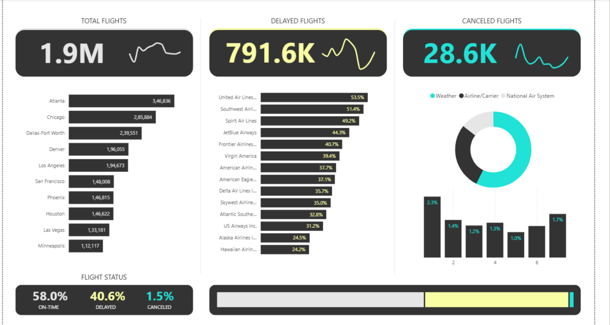

## Flight Status & Delay Analysis Dashboard

Power BI • SQL • Data Modeling • DAX • ETL • Visualization

This repository contains a **clean, demo-ready** version of the Flight Status project — with small sample data and the dashboard assets.  
The full dataset and Power BI file are large and available for download via Google Drive.

---

### 🔎 Project Summary

A complete BI solution to analyze flight delays, cancellations, airline performance, and airport traffic.  
Key components:

- **Data modeling** (star schema)
- **DAX measures** for KPIs
- **Time-series and aggregate analysis**
- **Power BI dashboard** with interactive filters & drill-downs

---

### 📁 Repo Contents (clean / demo-ready)

```text
flight_status_dashboard/
├── data/
│   ├── flights_sample.csv        # 100k row sample for quick demos
│   ├── airlines.csv              # airline lookup
│   ├── airports.csv              # airport lookup
│   └── cancellation_codes.csv    # cancellation reason codes
├── images/
│   └── dashboard.png             # screenshot of Power BI Overview
├── README.md
└── harsha_theme.json             # (optional) Power BI theme
```

---

### 📦 Full dataset & Power BI file (download)

The full `flights.csv` (~245 MB) and `Flight Status Dashboard.pbix` (~54 MB) are available here:

- **Google Drive**:  
  `https://drive.google.com/file/d/1x647AbDpihyrbb_BAQqX9XUj0VD5gUtG/view?usp=drive_link`

**Instructions:** download the ZIP/files from the Drive link and place the full `flights.csv` into the repository `data/` folder if you want to run the full analysis locally:

```text
<repo_root>/data/flights.csv
```

Open the `.pbix` file in Power BI Desktop to inspect the complete dashboard.

---

### ▶️ How to run (quick demo using sample)

1. **Clone this repo**:

```bash
git clone https://github.com/Harshaullikashi/flight_status_dashboard.git
cd flight_status_dashboard
```

2. **Open in Power BI (sample or full data)**:
- Open `Flight Status Dashboard.pbix` (if you downloaded it), **or**
- In Power BI: `Get data` → `Text/CSV` → select:
  - `data/flights_sample.csv`
  - `data/airlines.csv`
  - `data/airports.csv`
  - `data/cancellation_codes.csv`

3. **Explore the dashboard**:
- Use the `Overview` page to explore KPIs and the Actual vs Delay visuals.

---

### 📊 What’s included in the dashboard

- **Overview screenshot**  
  

- **KPI cards**: Total Flights, On-time %, Avg Arrival Delay, Cancellation Rate
- **Flight delay trends**: daily/monthly/yearly
- **Airline & airport performance comparisons**
- **Cancellation reason breakdown**
- **Route-level metrics**: origin → destination
=======
\# Flight Status \& Delay Analysis Dashboard


This repo contains a \*\*clean\*\* version of the Flight Status project with sample data for quick demos.


\## Full data \& Power BI file (large)

The full dataset (`flights.csv`, ~245 MB) and the Power BI file (`Flight Status Dashboard.pbix`, ~54 MB) are large and \*\*not included\*\* in this repository.


Download the full files here:

\- Full flights dataset (245 MB): \*\*\[OneDrive link - insert here]\*\*

\- Power BI file (54 MB): \*\*\[OneDrive link - insert here]\*\*


After downloading, place `flights.csv` in `data/` and open `Flight Status Dashboard.pbix` in Power BI Desktop.


